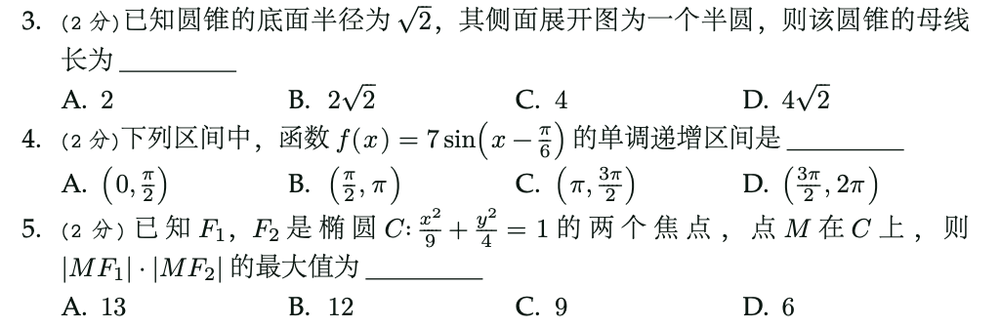
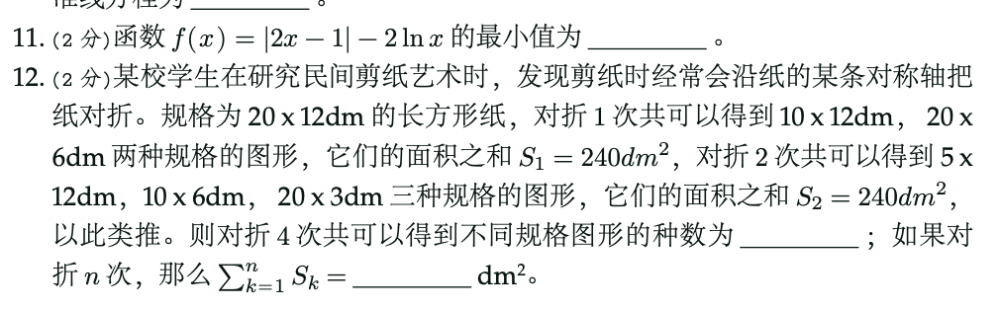
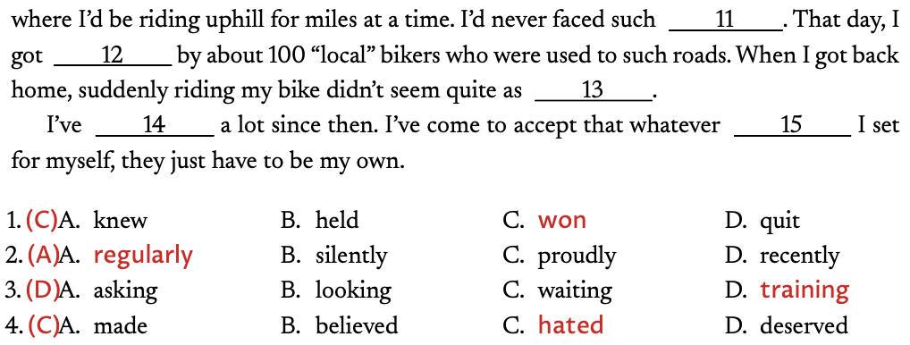
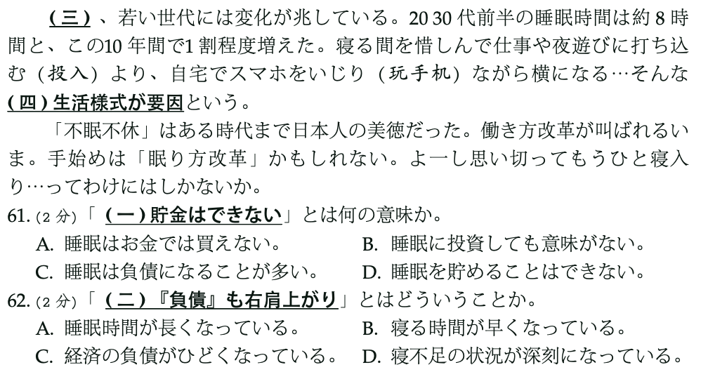

# basicexam 模塊

## 介紹

https://deepwiki.com/Soanguy/t-basicexam

一個簡單地試卷生成模塊，專用於 ConTeXt。目前具有的功能有：

- 選擇題
- 填空題
- 材料題
- 問答題
- 完形填空題
- 答案控制
- 分數控制
- 題頭控制

## 預覽

參見 `MANUAL and EXAMPLE` 文件夾下具體文件。









## 安裝

下載後，放置在 context 安裝路徑下（context-osx-arm64/tex/texmf-local/tex/context/third/）。

在終端中使用：`mtxrun --generate` 刷新文件索引。

在文件中使用 `\usemodule[basicexam]` 即可使用。

## 示例

```
\definepapertitle[list={key},key=value]
\setuppapertitle[keycolor=red]
```

```
\startquestion
  \startchoice
    \startcitem   choice 1 \stopcitem
    \startcitem[*]choice 2 \stopcitem
    \startcitem   choice 3 \stopcitem
    \startcitem   choice 4 \stopcitem
  \stopchoice
\stopquestion

--->
\startquestion
  \fastchoice{choice 1,\correct{choice 2},{[*]choice 3},choice 4}
\stopquestion
```

```
\startquestion
  \startproblem
    \startpitem[answer=answer 1] problem 1 \stoppitem
    \startpitem[answer=answer 2] problem 1 \stoppitem
    \startpitem[answer=answer 3] problem 1 \stoppitem
  \stopproblem
\stopquestion
```

```
\startmaterial[title={Knuth},author={Mos},source={Yelu}]
   some text here \indicator{underline text}
\stopmaterial
```

> 增加了在終端中的信息輸出，包括題號， 答案， 分值， 等內容。（`\usemodule[mode=check]` 即可啟用。）

# memos 模塊

文檔排版模塊，提供豐富的樣式和主題選項。

主要功能：
- **多種模式支持**：print（打印）、kindle（電子書）、draft（草稿）、moresize（更多尺寸）
- **多種顏色主題**：red、blue、yellow、green、black、cyan、orange、purple、pink、gray、white
- **多種章節樣式**：default、simple、classics、classicnovel、colorful、line、rocket、hexa、madsen、kaolike、publish、artical
- **多種目錄樣式**：default、simple、classics、classicnovel、colorful、line、rocket、hexa、madsen
- **多種頁眉樣式**：book、novel、colorful、hctext、fctext、foemargin、foemarginalt、hoemargin
- **靈活的頁面設置**：支持自定義紙張大小、行高、字體等
- **豐富的字號系統**：moresize 模式下提供從初號（42pt）到小九號（3pt）的完整字號體系
- **多語言支持**：原生支持中文簡體（hans）、繁體（hant）、日文和英文
- **字體特性支持**：支持大小寫轉換（case）、數字格式（pnum/tnum）、舊式數字（onum）等高級字體特性
- **PDF 交互功能**：自動生成書簽、支持超鏈接、目錄交互等
- **外部圖片支持**：自動按順序搜索 pdf、png、jpg 格式圖片
- **框架文本環境**：
  - `FrameText`：帶標題的框架文本（可設置標題、背景、邊框等）
  - `chappublish`、`chapissue`、`chapdate`、`chapsubtitle`：章節相關的框架
  - `LeftCodeExampleFramed`、`RightCodeExampleFramed`：代碼示例框架
- **文本背景環境**：
  - `simple`：簡單背景（圓角邊框）
  - `colorbox`：彩色框（深色背景）
  - `symbolbox`：符號框（帶符號裝飾）
  - `charbox`：字符框（帶字符裝飾）
  - `framebox`：框架框（帶框架裝飾）
  - `shadowbox`：陰影框（帶陰影效果）
  - `blockbox`：塊框（左側彩色條）
  - `barbox`：條框（透明背景的塊框）
  - `framedcode`：框架代碼（圓角、深色背景）
  - `halfframedcode`：半框架代碼（55% 寬度）
  - `wideframedcode`：寬框架代碼（跨邊距寬度）
  - `framelmverbatim`：框架逐字文本（左側彩色條）
- **引用命令**：
  - `refin`：引用到章節（如 `\refin[chap:sec1]` 顯示 "Chapter 1"）
  - `refat`：引用到頁碼（如 `\refat[chap:sec1]` 顯示 "Page 1"）
  - `linkto`：智能鏈接（print 模式下為 url，否則為 from）
- **自定義列表樣式**：
  - `ordinals`：序數列表（1, i, a, i 四級嵌套）
  - `points`：符號列表（bullet, diamond, asterisk, star 四級嵌套）
  - `remark`：備注枚舉（按章節編號）
- **描述環境**：
  - `excursus`：插入說明框（帶背景框）
  - `hangdescr`：懸掛描述
  - `topdescr`：頂部描述
  - `description`：標準描述
- **註釋系統**：
  - `marginnote`：邊註（顯示在頁邊距）
  - `sidenote`：側註（顯示在外邊距，帶星號標記）
- **特殊裝飾**：
  - `underround`：圓角下劃線
  - `bigunderdot`：大圓點下劃線
  - `shadowedsquare` / `shadowedcircle`：陰影方框/圓框符號
- **寬度調整**：
  - `widersame`：擴展到同側邊距
  - `widerside`：擴展到兩側邊距
  - `widerpara`：擴展段落寬度
  - `startwidenfloat` / `stopwidenfloat`：擴展浮動環境寬度


使用方法：
```tex
\usemodule[memos][
  papersize=A4,
  layout=moderate,
  mainlanguage=hans,
  lineheight=1.5\bodyfontsize,
  fontsize=11pt,
  themecolor=blue,
  chapterstyle=simple,
  hdrstyle=book,
]
```

> 💡 **字體配置**：memos 模塊支持豐富的字體選擇，包括 Adobe、Source、macOS、DynaFont 等多種字體集。詳細的字體配置說明請參閱 [字體 README](tex/context/third/basicexam/fonts/README.md)。

## zhindex 模塊

中文排序模塊，為 ConTeXt 提供中文索引排序功能。

主要功能：
- **拼音排序**（zh-pinyin）：按漢字拼音排序，同音字按拼音字母順序排列
- **字母排序**（zh-alpha）：中西文混排，按首字母分組，大小寫字母合併顯示
- **筆畫排序**（zh-stroke）：按漢字筆畫數分組，同筆畫數內按筆順代碼排序

使用方法：
```tex
\usemodule[zhindex]

% 設置索引排序方式
\setupregister[index][
  n=1,
  alternative=A,
  language=zh-pinyin,  % 或 zh-alpha, zh-stroke
]

% 在文檔中使用索引
\index{測試}
\index{排序}

\placeindex
```

排序規則：
- 數字歸類到 "number" 類別
- 西文字母歸類到 "alpha" 類別
- 中文根據選擇的排序方式進行相應排序


